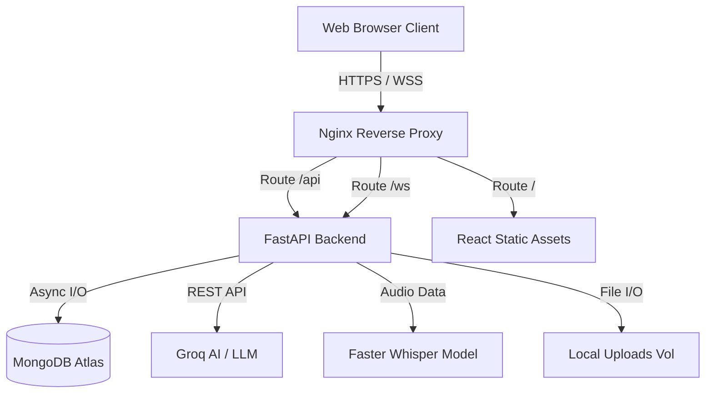
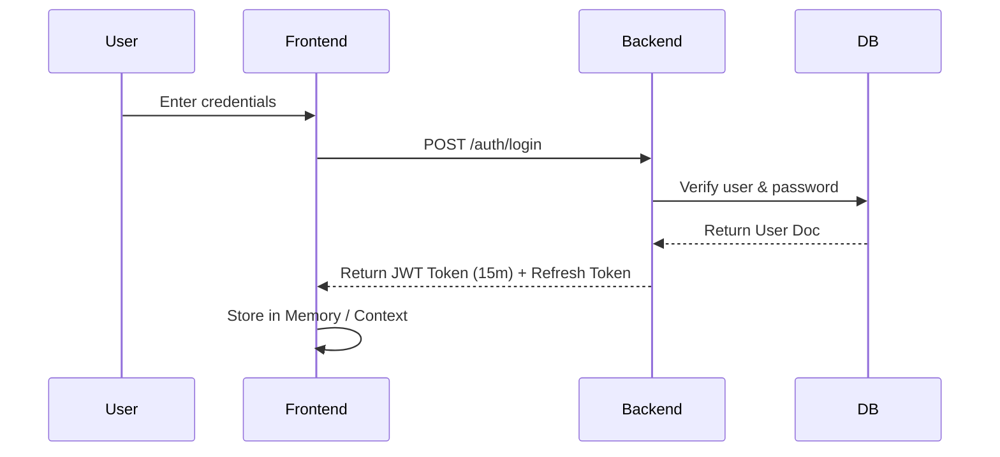
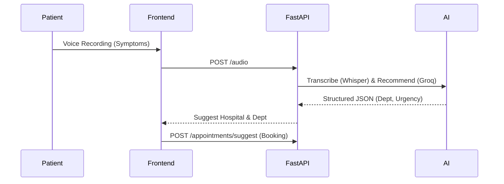

# System Architecture

The Q-Med system utilizes a modern, decoupled architecture. 

## High-Level Architecture Diagram

```mermaid
graph TD
    Client[Web Browser Client] -->|HTTPS / WSS| Nginx[Nginx Reverse Proxy]
    Nginx -->|Route /api| Backend[FastAPI Backend]
    Nginx -->|Route /ws| Backend
    Nginx -->|Route /| Frontend[React Static Assets]
    Backend -->|Async I/O| MongoDB[(MongoDB Atlas)]
    Backend -->|REST API| Groq[Groq AI / LLM]
    Backend -->|Audio Data| Whisper[Faster Whisper Model]
    Backend -->|File I/O| FileSys[Local Uploads Vol]
```

## Authentication Flow

```mermaid
sequenceDiagram
    participant User
    participant Frontend
    participant Backend
    participant DB
    
    User->>Frontend: Enter credentials
    Frontend->>Backend: POST /auth/login
    Backend->>DB: Verify user & password
    DB-->>Backend: Return User Doc
    Backend-->>Frontend: Return JWT Token (15m) + Refresh Token
    Frontend->>Frontend: Store in Memory / Context
```

## AI Appointment Flow

```mermaid
sequenceDiagram
    participant Patient
    participant Frontend
    participant FastAPI
    participant AI
    
    Patient->>Frontend: Voice Recording (Symptoms)
    Frontend->>FastAPI: POST /audio
    FastAPI->>AI: Transcribe (Whisper) & Recommend (Groq)
    AI-->>FastAPI: Structured JSON (Dept, Urgency)
    FastAPI-->>Frontend: Suggest Hospital & Dept
    Frontend->>FastAPI: POST /appointments/suggest (Booking)
```
